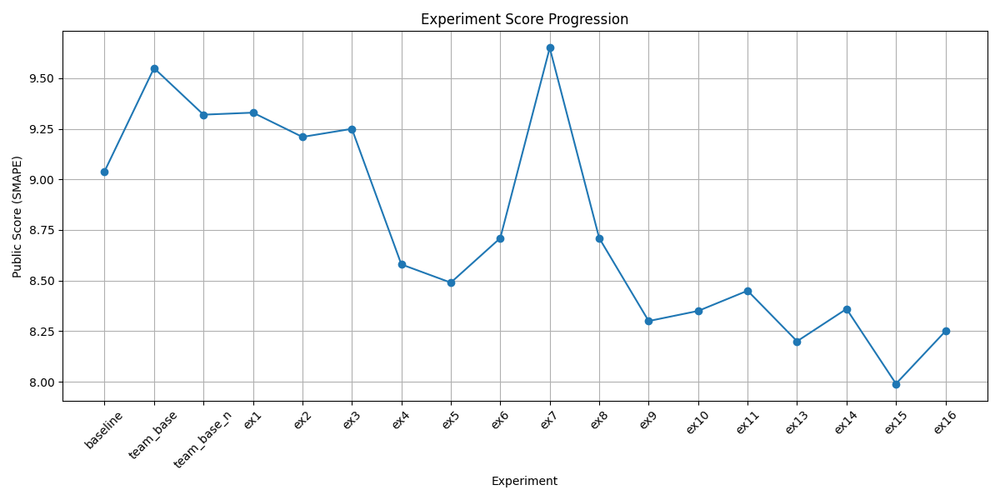

# ⚡ Building Energy Consumption Prediction

건물별 전력 소비량 데이터를 활용하여 미래 전력 사용량을 예측하는 머신러닝 모델을 구축하였다.
본 프로젝트는 **Feature Engineering 중심의 실험 로그 기반 모델 개선 과정**을 기록한다.

---

# 📊 Problem Description

건물의 전력 소비량은 다음 요소에 의해 크게 영향을 받는다.

* 기온 / 습도 / 풍속
* 건물 유형
* 시간대
* 주말 여부
* 냉방 수요

본 프로젝트의 목표는 이러한 정보를 활용하여 **건물별 전력 소비량(kWh)** 을 예측하는 것이다.

---

# 📦 Dataset

### Train

* 기간: **2022-06-01 ~ 2022-08-24**
* 건물 수: **100개**
* Target: **전력소비량(kWh)**

### Feature Categories

| 종류       | Feature                |
| -------- | ---------------------- |
| Weather  | 기온, 풍속, 습도, 강수량        |
| Time     | month, hour, dayofweek |
| Building | 건물유형, 연면적, 냉방면적        |
| Energy   | 태양광용량, ESS용량           |
| Derived  | DI, AT                 |

---

# 📈 Evaluation Metric

SMAPE

```
SMAPE = 100/n * Σ |y - ŷ| / ((|y| + |ŷ|)/2)
```

---

# 🧠 Model

```
XGBoost Regressor
```

주요 설정

```
enable_categorical = True
n_jobs = -1
```

---

# ⚙️ Pipeline Overview

```
Data Loading
      │
      ▼
Missing Value Processing
      │
      ▼
Feature Engineering
      │
      ▼
Building Metadata Merge
      │
      ▼
Building Pattern Clustering
      │
      ▼
Train / Validation Split
(Time-based)
      │
      ▼
XGBoost Training
      │
      ▼
Prediction
```

---

# 🔬 Experiment Log

## Baseline

### base.ipynb

초기 파이프라인 구축

**Features**

```
건물번호
기온(C)
강수량(mm)
풍속(m/s)
습도(%)
DI
month
day
hour
dayofweek
is_holiday
```

| pub  | pri  |
| ---- | ---- |
| 9.04 | 10.8 |

---

# 1️⃣ Pipeline Stabilization

## team_base

### Improvements

* 결측치 처리

```
강수량 / 일사 / 일조량 → 0
풍속 / 습도 / 기온 → 선형 보간
```

* TimeSplit Validation
* SMAPE Metric 적용

| pub  | pri   | val  |
| ---- | ----- | ---- |
| 9.55 | 10.46 | 13.3 |

---

## team_base_n

공휴일 정의 수정

```
06-06
08-15
주말 포함
```

| pub  | pri   | val  |
| ---- | ----- | ---- |
| 9.32 | 10.37 | 12.5 |

---

# 2️⃣ Feature Engineering

## Apparent Temperature (AT)

체감온도 Feature 추가

```
AT = 1.04 * temp + 0.2 * vapor_pressure - 0.65 * wind - 2.7
```

| pub  | pri   | val  |
| ---- | ----- | ---- |
| 9.33 | 10.30 | 13.1 |

---

# 3️⃣ Building Metadata

## team_ex4 (Major Improvement)

건물 정보 Feature 추가

추가 Feature

```
건물유형
연면적
냉방면적
태양광용량
ESS저장용량
PCS용량
```

| pub  | pri  | val   |
| ---- | ---- | ----- |
| 8.58 | 9.75 | 10.68 |

Baseline 돌파

---

# 4️⃣ Time Feature Engineering

## Hour Cyclic Encoding

시간 주기성 반영

```
hour_sin
hour_cos
```

| pub  | pri  |
| ---- | ---- |
| 8.30 | 9.28 |

---

# 5️⃣ Data Cleaning

## Closed Day Detection

임시 휴무일 제거

기준

```
일별 전력 사용량
/
건물 평소 사용량
< 0.3
```

| pub  | pri  |
| ---- | ---- |
| 8.35 | 9.20 |

---

# 6️⃣ Building Behavior Clustering

건물 사용 패턴 기반 클러스터링

Feature

```
평균 전력 사용량
기온-전력 상관관계
주말 사용 패턴
```

```
KMeans Clustering
```

| clusters | pub      | pri      |
| -------- | -------- | -------- |
| 4        | 8.45     | 9.38     |
| **5**    | **8.20** | **8.91** |
| 6        | 8.36     | 9.11     |

Best → **5 clusters**

---

# 7️⃣ Feature Selection

### Remove day feature

트리 모델 과적합 방지

| pub      | pri      | val      |
| -------- | -------- | -------- |
| **7.99** | **8.46** | **9.17** |

---

# 🏆 Final Score

| Public   | Private  | Validation |
| -------- | -------- | ---------- |
| **7.99** | **8.46** | **9.17**   |

---
## 📈 Performance Trend


# 📊 Final Features

```
건물번호
건물유형
연면적
냉방면적
태양광용량
ESS저장용량
PCS용량

기온
풍속
습도
강수량
DI
AT

month
hour_sin
hour_cos
dayofweek
is_holiday
is_weekend

building_cluster
```

---

# 🔮 Future Work

추가 개선 방향

* Lag Feature
* Building-wise model
* Cluster-based model
* Hyperparameter tuning
* Temperature interaction features

---

# 📌 References

Feature Importance 확인

```
model.feature_importances_
xgb.plot_importance(model)
```
